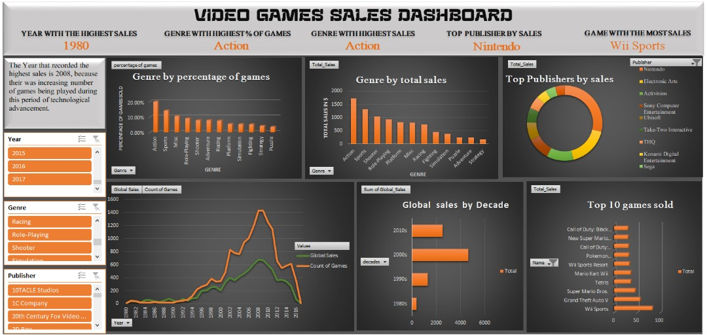

# VIDEO GAME SALES DATASET 

[Image source](https://img.redbull.com/images/c_limit,w_1500,h_1000,f_auto,q_auto/redbullcom/2014/12/17/1331695582349_2/the-10-best-games-of-2014-as-voted-by-you)
## INTRODUCTION
The sales store based in Bali has a dataset which contains records of popular video games in North America, Japan, Europe and other parts of the world. Every video game in this dataset has sold greater than 100,000 copies globally. 
The dataset was sourced from [kaggle](https://www.kaggle.com/datasets/gregorut/videogamesales/data)
## PROBLEM STATEMENTS:
As a Data analyst, you have been called to the sales store to analyze and draw meaningful insights from the video games sales dataset which would aid the management in making informed decisions.
* Genre with the highest percentage of games
* Genre with the highest sales
* Top 10 publishers by sales 
* Top 10 games sold 
* What year had the highest sales and suggest why it happened

## DATA DICTIONARY
- **Rank**:  Ranking of overall sales
- **Name**: Name of the game
- **Platform**: Platform of the games release (i.e. PC,PS4, etc.)
- **Year**: Year the game was released in
- **Genre**: Genre of the game
- **Publisher**: Publisher of the game
- **NA_Sales**: Number of sales in North America (in millions)
- **EU_Sales**: Number of sales in Europe (in millions)
- **JP_Sales**:Number of sales in Japan (in millions)
- **Other_Sales**: Number of sales in other parts of the world (in millions)
- **Global_Sales**: Number of total sales (in millions)

## SKILLS/CONCEPTS EXHIBITED:
- Pivot Tables
- Data visualization 
- Sorting and filtering
- Data Grouping
- Conditional formatting

## INSIGHTS:
From the analysis on the dataset provided 

 **The Genre with the highest percentage of games is **Action****

  **The Genre with the highest sales is **Action****

 **Top 10 publishers by sales**
 
 

 **Top 10 games sold**

 

 **What year had the highest sales and suggest why it happened**

    

The Year that recorded the highest sales is 2008, because  their was increasing number of games being played during this period of technological advancement.

## DATA VISUALISATION:

*This dashboard is interactive and can be interacted with in the Microsoft Excel file attached*
